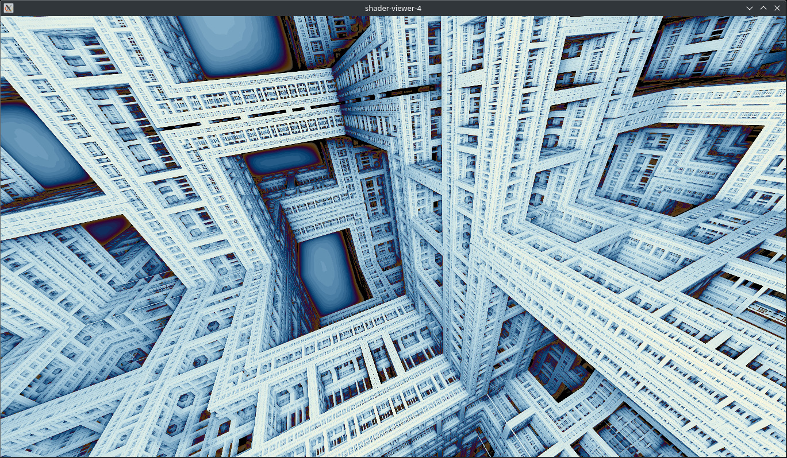

# shader-viewer-4

OpenGL based shader loading and rendering application, with built-in camera controls.



## Getting Started

### Prequisites
- CMake https://cmake.org/
- vcpkg https://github.com/microsoft/vcpkg
    - Follow Microsoft's instruction on setting up and boostrapping vcpkg.
    - Set the `VCPKG_ROOT` environment variable. Or set `-D VCPKG_ROOT=/path/to/vcpkg` on CMake command line.
    - https://learn.microsoft.com/en-us/vcpkg/get_started/get-started

### Building
```
$ git clone https://github.com/matthewgattis/shader-viewer-4.git
$ mkdir -p shader-viewer-4/build
$ cd shader-viewer-4/build
$ cmake -D CMAKE_BUILD_TYPE=Release ../
$ cmake --build .
```

### Running
- The shader viewer accepts an arguemnt path to the fragment shader file to load.
- If running from the build directory, you can load the example shader with:
```
$ ./shader-viewer-4 ../example.glsl
```
- The provided shaders can be quite demanding. They are presented here roughly in order from least to most.
- `example.glsl`: Ray marched rendering of two cubes.
- `kaleidoscopic-ifs.glsl`: Ray marched rendering of the Kaleidoscopic IFS fractal.
- `mandelbox.glsl`: Ray marched rendering of the Mandelbox fractal.

### Controls
- Orbit controls:
    - *Right mouse button:* Orbit/rotate around pivot.
    - *Middle mouse button:* Pan view.
    - *Scroll wheel:* Zoom in/out.
    - *Left+right mouse button:* Zoom in/out.
- Free look:
    - *Left mouse button:* Free look.
    - *W, A, S, D:* Move.
    - *Space:* Ascend.
    - *Left shift:* Descend.
- Both of these control schemes are active at the same time.
- Camera movement speed is influenced by zoom.
    - Zoom in to slow down.
    - Use UI to reduce camera pivot distance to slow down.
- *R:* Reload shader.
- *Q:* Unload shader.
- *G:* Open GUI.
- *F, F11:* Fullscreen.
- *C:* Reset camera.

## Tasks
- Add more UI controls.
- Pass camera projection matrix to shader.
    - Think I can use this to implement a double click to focus.
    - Similar to MeshLab.
    - Much less sure about this.
- Refactor `app.cpp`.
- Better example shader(s).
