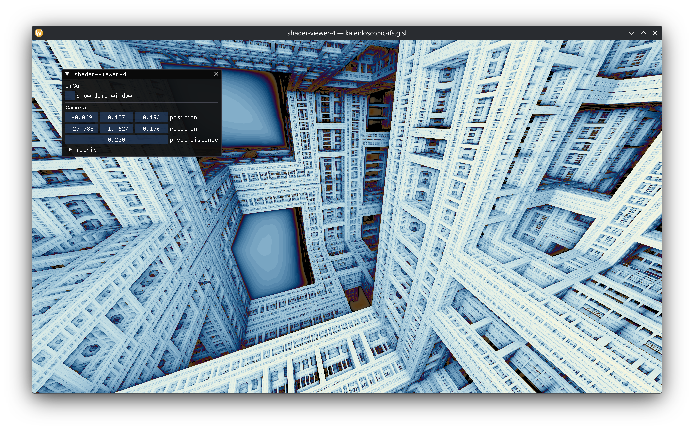

# shader-viewer-4

An interactive OpenGL fragment shader viewer with a physics-based camera. Load any GLSL fragment shader and explore it in real time with orbit, pan, zoom, and free-look controls. Supports hot-reloading shaders from disk without restarting.



## Features

- **Live shader rendering** — renders any GLSL fragment shader onto a full-screen quad at interactive frame rates
- **Hot-reload** — press `R` to reload the shader from disk; press `Q` to unload
- **Dual camera modes** — orbit and free-look are active simultaneously
- **Physics-based movement** — smooth velocity and friction for natural camera feel; movement speed scales with zoom level
- **Dear ImGui overlay** — toggle with `G` to inspect camera position, rotation, pivot distance, and the full view matrix
- **Fullscreen and window size presets** — `F`/`F11` for fullscreen; keys `0`–`7` for preset resolutions
- **High-DPI support** — enabled by default; disable with `--low-dpi`
- **Error resilience** — shader compile/link errors are logged to stderr and fall back to a blank screen without crashing

## Getting Started

### Prerequisites

- [CMake](https://cmake.org/) >= 3.22 (with [Ninja](https://ninja-build.org/))

All other dependencies (SDL2, GLEW, GLM, Dear ImGui, argparse) are fetched and built automatically by vcpkg.

### Building

```bash
git clone --recurse-submodules https://github.com/matthewgattis/shader-viewer-4.git
cd shader-viewer-4
cmake --preset default
cmake --build --preset default
```

The `default` preset places the build in `build/`, and builds in Release mode. A `debug` preset is also available.

### Running

```bash
./build/shader-viewer-4 <path/to/shader.glsl>
```

To load the included example shader:

```bash
./build/shader-viewer-4 example.glsl
```

Pass `--low-dpi` to disable high-DPI scaling:

```bash
./build/shader-viewer-4 --low-dpi example.glsl
```

### Included Shaders

Three example shaders are provided, listed roughly from least to most GPU-demanding:

| Shader | Description |
|---|---|
| `example.glsl` | Ray-marched scene with two repeating cubes |
| `kaleidoscopic-ifs.glsl` | Ray-marched [Kaleidoscopic IFS](https://en.wikipedia.org/wiki/Iterated_function_system) fractal |
| `mandelbox.glsl` | Ray-marched [Mandelbox](https://en.wikipedia.org/wiki/Mandelbox) fractal |

## Controls

### Camera

| Input | Action |
|---|---|
| Right mouse button | Orbit / rotate around pivot |
| Middle mouse button | Pan |
| Scroll wheel | Zoom in / out |
| Left + right mouse buttons | Zoom in / out |
| Left mouse button | Free look |
| W / A / S / D | Move forward / left / back / right |
| Space | Ascend |
| Left Shift | Descend |

Both orbit and free-look controls are active at the same time.

Camera movement speed scales with zoom level — zoom in to slow down, or reduce the camera pivot distance in the GUI panel.

### Hotkeys

| Key | Action |
|---|---|
| R | Reload shader from disk |
| Q | Unload shader (blank screen) |
| T | Reset time |
| C | Reset camera |
| G | Toggle GUI overlay |
| F / F11 | Toggle fullscreen |
| 0 – 7 | Set window to a preset resolution |

## Writing Shaders

Fragment shaders receive the following uniforms:

| Uniform | Type | Description |
|---|---|---|
| `Resolution` | `vec3` | `x` = width, `y` = height, `z` = aspect ratio |
| `Time` | `float` | Seconds elapsed since startup (reset with `T`) |
| `ViewMatrix` | `mat4` | Camera view matrix for ray marching |

The vertex shader exposes an additional input:

| Variable | Type | Description |
|---|---|---|
| `FragCoord` | `vec2` | Aspect-corrected screen-space coordinate (analogous to ShaderToy's `fragCoord / iResolution`) |

All uniforms are optional — if a uniform is not declared in your shader, it is silently ignored.

### Minimal Example

```glsl
#version 150

uniform vec3 Resolution;
uniform float Time;

in vec2 FragCoord;
out vec4 FragColor;

void main() {
    vec2 uv = FragCoord * 0.5 + 0.5;
    FragColor = vec4(uv, 0.5 + 0.5 * sin(Time), 1.0);
}
```

## Architecture

| Component | Description |
|---|---|
| `app.cpp` | Main loop, event handling, uniform updates, window resize |
| `camera.cpp` | Orbit and free-look camera with physics-based movement |
| `sandboxmaterial.cpp` | Loads, compiles, and hot-reloads the user fragment shader; manages uniforms |
| `sandbox.cpp` | Pairs a full-screen quad geometry with the sandbox material |
| `planegeometry.cpp` | Full-screen quad VAO/VBO/IBO |
| `uicontext.cpp` | Dear ImGui initialization with DPI-aware font scaling |
| `mainwindow.cpp` | Top-level ImGui window hosting UI panels |
| `cameraui.cpp` | ImGui camera inspector |

## Tasks

- Add more UI controls.
- Pass camera projection matrix to shader.
    - Could enable double-click-to-focus, similar to MeshLab.
- Refactor `app.cpp`.
- Better example shader(s).
